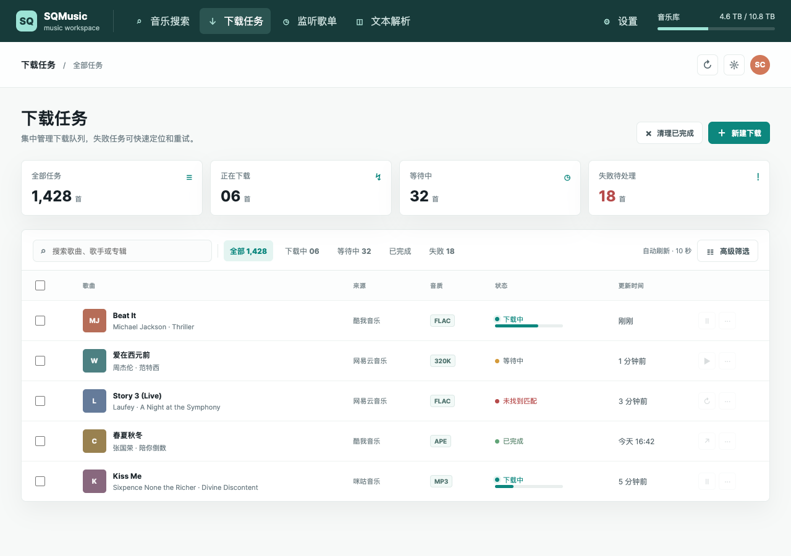
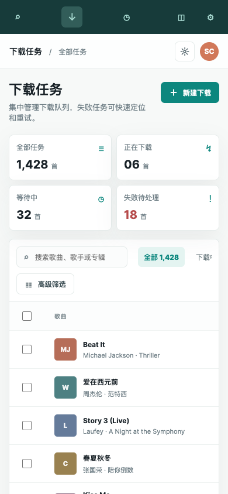

# SQmusic UI Neo

Simple SQ Music Plus 的第三方开源 Web 前端。项目采用单文件架构，核心页面位于 `frontend/index.html`，使用原生 HTML、CSS 和 JavaScript 编写，不需要 Node.js、包管理器或构建工具。

本项目只提供前端界面，不包含音乐搜索、下载、数据库或账号服务。使用前必须先部署一个可用的 [Simple SQ Music Plus 后端](https://github.com/59799517/simple_sq_music_plus)。本项目与上游项目作者没有隶属关系。

## 预览





## 功能

- 登录、退出登录和会话续期
- 单曲、歌手、专辑搜索，以及多音源聚合搜索
- 搜索建议、歌词、试听、歌曲详情和专辑详情弹窗
- 单曲下载、整张专辑下载、歌手专辑批量下载
- 下载任务列表、状态筛选、高级筛选、分页和自动刷新
- 单项重试、批量重试、删除任务、清理任务和错误重试记录查看
- 系统、插件和扩展配置管理，仅保存被修改的配置项
- 网易云歌单监听、新增、删除和状态查看
- 文本解析、链接解析和批量下载
- 阿里云盘授权、目录配置、全量/增量同步和上传记录
- 酷狗、QQ 音乐登录二维码及相关凭据操作
- 桌面端和移动端响应式界面
- 明暗主题、运行时 Web App Manifest、导入歌单数据
- 可选的后端 API 地址配置，支持同源反向代理或跨域部署

## 快速部署

### 推荐方式：同源反向代理

将 `frontend/index.html` 放到静态 Web 服务器，并把以下路径转发到 Simple SQ Music Plus 后端：

```text
/api/*  -> 后端 /api/*
/mcp   -> 后端 /mcp（可选）
```

然后访问前端地址，登录页的“后端 API 地址”留空即可。

Nginx、Caddy、Docker 和跨域直连示例请参考：[DEPLOY.md](DEPLOY.md)。

### 直接打开文件

可以直接用浏览器打开 `frontend/index.html` 查看界面，但浏览器的 `file://` 安全策略通常会影响 API 请求。正式使用建议放在 Nginx、Caddy 或其他静态服务器后面。

### 后端 API 地址

登录页可以填写完整的 API 前缀，例如：

```text
https://music.example.com/api
http://192.168.1.10:8099/api
```

地址必须包含 `/api`，留空表示使用当前站点的同源 `/api`。跨域直连时，后端还必须正确配置 CORS；如果不确定，请使用同源反向代理。

## 兼容性

- 已按 Simple SQ Music Plus `v3.1.20` 的接口行为开发和验证。
- 不同后端版本可能存在接口字段、权限校验或配置项差异。
- 前端需要后端返回统一响应格式：

```json
{
  "code": 200,
  "msg": "success",
  "data": {}
}
```

受保护接口需要同时携带以下请求头，前端会自动处理：

```http
Authorization: Bearer <token>
sqmusic: <token>
```

## 主要接口范围

前端目前覆盖以下后端模块：

| 模块 | 路径范围 |
| --- | --- |
| 配置 | `/api/config/*` |
| 搜索与播放 | `/api/music/*` |
| 下载 | `/api/download/*` |
| 下载任务 | `/api/task/*` |
| 歌单监听 | `/api/monitor/*` |
| 链接解析 | `/api/parser/*` |
| 插件操作 | `/api/plug/kg/*`、`/api/plug/qqvip/*` |
| 阿里云盘 | `/api/expand/ali/*` |

## 重要接口行为

### 下载任务筛选

`POST /api/task/list` 使用以下字段：

```text
pageIndex
pageSize
downloadStatus
downloadPlugName
downloadMusicname
downloadArtistname
downloadAlbumname
downloadTimeStart
downloadTimeEnd
```

响应中的主要分页字段为 `records`、`total`、`size`、`current` 和 `pages`。

### 错误任务重试

- `errorTaskRetry`：只查询错误重试子任务，不会触发重试。
- 单个任务重试：使用 `refreshTask`。
- 全部错误任务重试：使用 `againTask`。

### 搜索和播放

`getDownloadUrl` 需要提交完整歌曲对象。只提交 `id`、`plugName`、`brType` 等少量字段，可能导致后端空指针错误。

### 后端字段兼容

部分后端版本的解析接口返回 `plugNmae`，这是后端已有的拼写字段。前端同时兼容 `plugName` 和 `plugNmae`。

## 已知限制

- 本项目不包含后端、数据库、音乐源账号或下载器。
- 第三方音乐源是否可用取决于后端插件配置、登录状态、地区限制和服务商接口状态。
- QQ 音乐、酷狗和阿里云盘相关功能需要后端完成对应授权，未授权时接口返回错误属于预期情况。
- PWA Manifest 是运行时注入的；当前项目没有内置离线缓存资源，不能把它当作完整离线应用使用。
- 下载文件名模板由后端版本决定。Simple SQ Music Plus `v3.1.15+` 使用静态变量，不支持 SpEL 条件表达式，例如：

```text
\${musicName}
\${artists}
\${artist}
\${album}
\${albumId}
\${albumTime}
\${albumYear}
\${albumMonth}
\${albumDay}
\${artistsId}
```

- 前端只负责提交下载任务，实际下载失败应结合后端日志、插件登录状态、音源可用性和歌曲匹配结果排查。

## 本地开发与检查

项目无需安装依赖。修改 `frontend/index.html` 后，可以使用以下命令检查内嵌 JavaScript 语法：

```sh
awk '/<script>/{flag=1;next}/<\\/script>/{flag=0}flag' \
  frontend/index.html > /tmp/sqmusic-frontend.js
node --check /tmp/sqmusic-frontend.js
```

本地预览可以使用任意静态服务器，例如：

```sh
python3 -m http.server 4173
```

然后打开：

```text
http://127.0.0.1:4173/frontend/
```

如果前端和后端不在同一来源，请填写后端 API 地址并配置 CORS；本地开发更推荐使用反向代理。

## 项目结构

```text
.
├── frontend/
│   └── index.html    # 完整前端应用
├── DEPLOY.md         # Nginx、Caddy、Docker 和跨域部署说明
├── LICENSE           # MIT License
└── README.md
```

## 相关项目

- 上游后端：[Simple SQ Music Plus](https://github.com/59799517/simple_sq_music_plus)

## 贡献

欢迎提交 Issue 和 Pull Request。提交功能修改时，建议同时说明：

1. 使用的后端版本。
2. 涉及的接口路径和请求字段。
3. 桌面端和移动端的验证结果。
4. 是否影响现有部署方式或旧版前端。

## License

本项目使用 [MIT License](LICENSE)。上游项目的代码、名称和服务条款以其仓库说明为准。
